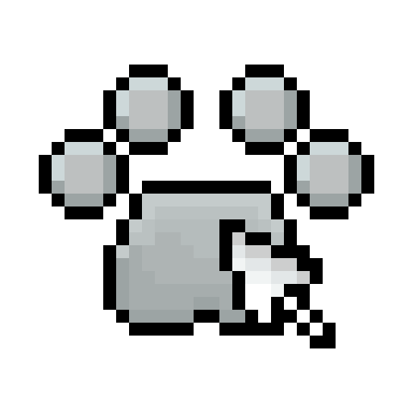

# pawEng 
---

Game engine written in JavaScript. Created to be completely scalable, allowing the developer to extend functionality by inheriting base entities and overriding their behavior

### Install
```sh
npm i paw-engine
```

## Usage

| Command | Description |
| :--- | :---: |
| help | Shows help information |
| run | Starts dev server using Vite |
| build | Builds your project |

## Command options and flags

- #### Development Server (run)
  - --host: Exposes the server to your local network. (Optional).
  - --port <number>: Specifies a custom port for the server. (Optional. Default: 8080).

- #### Web build (build --web)
  - --out <folder>: Defines the output path for the web build. (Optional. Builds in 'webBuild' folder if not provided).

- #### Desktop build (build { --win | --linux | --osx })
  - --web-dir <folder>: Paths to your existing web build directory. (Optional. Uses 'webBuild' folder if not provided).
  - --name <string>: Sets the application name.
  - --company <string>: Sets the developer or company name.
  - --version <string>: Sets your project version.
  - --description <string>: Sets description to the executable file.
  - --out <folder>: Defines the output path for the desktop binaries. (Optional. Builds in 'executableBuild' folder if not provided).


### Why pawEng?
- Uses only pure JavaScript
- Completely scalable
- Easy to get into, so anyone can make their first game


***Look at the examples in the examples folder.***
